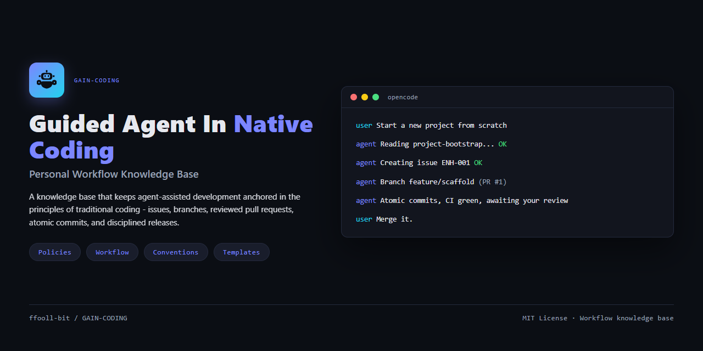
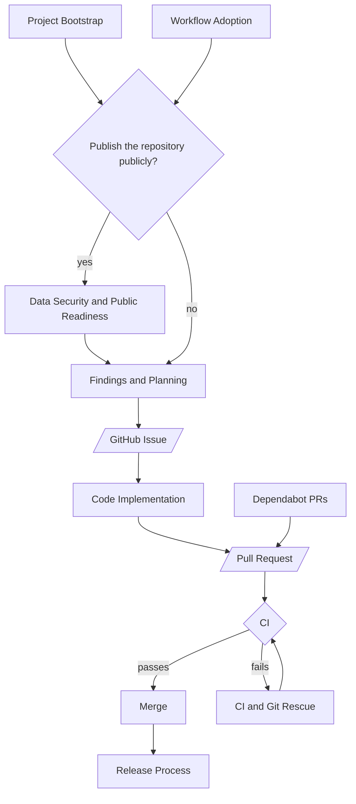

<div align="center">

<h1>GAIN-CODING</h1>



**Guided Agent In Native Coding** — a personal workflow knowledge base for keeping agent-assisted development anchored in the principles of native (traditional) coding.

</div>

## Overview

GAIN-CODING is an **information repository**, not application code. It turns the working principles of traditional coding into a set of documents an AI agent can follow (and, with any luck, not reinterpret into something unrecognizable). You do not read this repository as code; you hand your agent the document that matches the task you want done.

GAIN is an attempt to combine the discipline of traditional coding with the speed of AI-assisted development. The sections below explain the trade-off: traditional coding brings the discipline, vibe coding brings the speed, and GAIN tries to keep both (in theory — the speed part still works better than the discipline part).

### Native (Traditional) Coding

Traditional coding is the discipline that professional software development has long depended on: issues before changes, clean branches, reviewed pull requests, atomic commits, tested builds, and disciplined releases.

It is deliberate and time-tested, but it is slow and human-driven (read: boring, but it works).

### Vibe Coding

"Vibe coding" describes an AI-assisted style of development where developers let an AI agent write most of the code and primarily ride the flow rather than follow a deliberately structured development process.

With sufficiently capable models, many of its weaknesses can be reduced. Better models can understand context, follow instructions, reason about changes, and produce reliable code with less guidance. But access to those models is not universal. Free models can be surprisingly capable, too, but their results can be much more sensitive to the quality, precision, and context of the prompt.

That can make vibe coding remarkably fast and effective when everything lines up. The trade-off becomes expensive when it does not: changes may be poorly tracked or reviewed, important checks may be skipped, secrets may end up in the repository, and code can become difficult to understand or safely modify.

**The results are _easy to love_ while the demo works, and _expensive to live with_ the moment something breaks.**

### GAIN Coding

GAIN stands for **Guided Agent In Native Coding**. The word **“native”** is deliberately a stretch — it is there to make the acronym work, while pointing to the conventional coding practices that came before agent-assisted development.

The idea is simple: one person wanted the agent to write their code, but still wanted to keep the habits that traditional coding had taught them.

This repository is not a solution, a movement, or a claim that vibe coding is wrong. It is a personal experiment, made for fun, for one environment, by one developer who likes having the agent do the work while still feeling like a proper developer.

At its core, it does three things:

- **Native principles stay first.** A strict GitHub-based workflow: issue-driven changes, protected branches, no direct pushes, atomic conventional commits, previews before merging (the parts nobody gets excited about, the parts that actually keep it together).
- **The agent does the work, not the deciding.** The AGENT executes the workflow — creating issues, branching, implementing, committing, pushing, and opening pull requests — while the USER stays the reviewer and approver at every gate.
- **Workflow is written down, not remembered.** Every policy, flow, and format specification lives in this repository as versioned documentation.

The honest summary: the agent does the heavy lifting, the rules keep things respectable, and nobody here is claiming to have solved software engineering (yet).

### Disclaimer

This repository was created for **personal use** and designed for a specific environment. It is primarily intended for people running a similar setup: Windows, [Visual Studio Code](https://github.com/microsoft/vscode), [OpenCode](https://github.com/anomalyco/opencode), [Magic Context](https://github.com/cortexkit/magic-context), [GitHub CLI](https://github.com/cli/cli) (`gh`), the [ponytail skill](https://github.com/dietrichgebert/ponytail), and DeepSeek V4 Flash Free as the primary agent model.

Anyone with a similar setup is welcome to adapt, extend, and contribute to this knowledge base, but there is no guarantee that it will work well outside that environment.

## How to Use

GAIN-CODING is a **workflow knowledge base for AI-assisted development**. You do not need to give the agent the entire repository. Instead, provide only the documents relevant to the task at hand. This is **progressive context loading**: give the agent enough context to follow the rules, but not so much context that the rules become noise.

> The prompts below are starting points, not a script. Treat them as a draft you are expected to adjust, improve, and reshape for your own situation — and if you make one better, contributions are welcome.

### Phase 1 — Initialize the Agent

At the beginning of a new session, make sure the agent has the five core policies available in its context or memory.

If they are already available, skip this phase. Otherwise, load the following documents **one at a time, in order**, and wait for the agent to confirm each before providing the next. Keep the agent in **plan mode** for this whole phase, not build mode, so it cannot execute anything — it only reads, confirms, and waits.

Start by sending the prompt below, which tells the agent what is about to happen and how to behave:

```text
You are working in a Windows environment with Visual Studio Code and OpenCode, using Magic Context for memory, the GitHub CLI (`gh`) for repository operations, the ponytail skill to keep things simple, and DeepSeek V4 Flash Free as your primary agent model. This session runs in two context-loading phases before any work begins:

- Phase 1 — the core policies: I give you the five core policies of this project, one at a time, in order. This happens once, at the start of the session.
- Phase 2 — the workflow: once the policies are loaded, I give you a workflow document that defines the interactions between us. This may happen again during the session whenever we switch to a different workflow.

When both phases are loaded, we enter the interaction phase: I trigger each interaction from the workflow, you execute it, present the result, and stop until I give the next one.

Phase 1 starts now. I will give you the five core policies, one at a time, in order. For each document:

1. Read it fully.
2. Confirm that you have read it and summarize its rules, exceptions, and tie-breakers in 1-2 sentences.
3. Do not offer analysis, suggestions, or proposals yet.
4. Wait for the next document.

Read only the document I give you. Do not open other files, follow links, or search for additional context — if you need more information, I will provide it in a later phase. Some documents may feel incomplete on their own; remember them as-is, and the full picture will become clear as the following documents arrive.

Context is given to you progressively, on purpose. You do not need to find it yourself — just read, understand, and wait.
```

1. #### **[Core Rules](playbook/policies/core-rules.md)** — the workflow principles that cannot be bypassed.

   ```text
   Read this document fully: {URL}
   It defines the workflow principles you must follow for the rest of this session.
   ```

2. #### **[Repository Protection](playbook/policies/repository-protection.md)** — the GitHub settings that enforce the workflow.

   ```text
   Read this document fully: {URL}
   It explains the GitHub protection settings that enforce the workflow, including branch protection, merge methods, and restrictions on direct pushes.
   ```

3. #### **[Merge Strategy](playbook/policies/merge-strategy.md)** — how pull requests enter the target branch for each case.

   ```text
   Read this document fully: {URL}
   It defines how a pull request enters the target branch for each case, including when to use squash, rebase, or merge.
   ```

4. #### **[Branching Model](playbook/policies/branching-model.md)** — the branch layout and how to select the appropriate branch.

   ```text
   Read this document fully: {URL}
   It explains the branch layout, the basic flow, and which branch model to choose for a project.
   ```

5. #### **[Boundaries](playbook/policies/boundaries.md)** — the limits that apply to the agent's operation.

   ```text
   Read this document fully: {URL}
   It defines the boundaries you must respect, including communication language, line wrapping, approval requirements, and the operating environment.
   ```

### Optional Step — Save the Policies to Memory (Magic Context)

Magic Context only helps **across sessions**, not within the current one. In this session the five policies are already loaded into the agent's context, so nothing needs saving here. To let the next session skip Phase 1, ask the agent to save the policies to its project memory once Phase 1 finishes:

```text
Save the five core policies of this project I gave you to your project memory. For each of the five documents run:
ctx_memory(action="write", category="PROJECT_RULES", content="<short summary of the rule in English, including every exception and tie-breaker clause stated in the document> Source: <URL of the document>")
A rule without its exceptions is misleading, so keep them when they exist. Then check your injected <project-memory> block and confirm the five are present. Finish by telling me the memory IDs you created.
```

To skip Phase 1 on the next session, start the new agent session and check before sending the prompt:

```text
Do you have the five core policies of this project in your injected <project-memory> block? Check the block for all five: Core Rules, Repository Protection, Merge Strategy, Branching Model, and Boundaries. If all five are present, tell me which ones you remember and wait for my next instruction. If any are missing, I will give you the five policy documents to read again.
```

As long as the stored context stays valid, future sessions can start directly from Phase 2. If it does not, repeat Phase 1.

> This step can stay in **plan mode**. I have verified that the ctx tools keep working while plan mode is active, because they write to an external database rather than to the project. If you are not sure about your environment, build mode works just as well.

### Phase 2 — Choose a Workflow

In this phase you introduce the workflow the agent will run. Each workflow is executed interaction by interaction: you drive, and the agent stops after each interaction and waits.

All workflows run in **plan mode**; switch to **build mode** only when a specific interaction requires it to make changes (for example, creating files, running a command, or opening a pull request), and return to plan mode as soon as the interaction is done. The workflows rely on the GitHub CLI (`gh`); if it is not authenticated, run `gh auth login` and follow the browser login instructions.

Start by sending the prompt below, which sets the ground rules for every workflow of the session:

```text
You have now loaded the five core policies in Phase 1. We are moving into Phase 2: I will give you a workflow document that defines the interactions between us.

These rules apply to every workflow document from here on:
- Read the document only. Do not open other files, follow links, or search for additional context.
- Stay in plan mode — do not execute anything. Read the flow, understand it, and memorize it.
- Each document defines a sequence of interactions between you (the AGENT) and me (the USER) — I trigger each one, so after each you present the result and stop.
- After reading, present the interactions the document contains, then save the workflow to your project memory only if this workflow is not already saved there — do not store the same workflow twice (this does not limit writing other entries to PROJECT_RULES):
    ctx_memory(action="write", category="PROJECT_RULES", content="<short summary of the workflow and its approval checkpoints in English> Source: <URL of the document>")
- Then wait for my instruction to begin the first interaction.

Reply READY once you are ready to receive the workflow document.
```

This first prompt covers the first workflow of the session. When you later switch from one workflow to another, restate the Phase 2 rules with the prompt below, so the agent re-engages with the new document:

```text
We are switching to a different workflow. The same Phase 2 rules apply again, so I restate them:

- Read only the document I give you. Do not open other files, follow links, or search for additional context.
- Stay in plan mode — do not execute anything. Read the flow, understand it, and memorize it.
- Each document defines a sequence of interactions between you (the AGENT) and me (the USER) — I trigger each one, so after each you present the result and stop.
- After reading, present the interactions the document contains, then save the workflow to your project memory only if this workflow is not already saved there — do not store the same workflow twice (this does not limit writing other entries to PROJECT_RULES):
    ctx_memory(action="write", category="PROJECT_RULES", content="<short summary of the workflow and its approval checkpoints in English> Source: <URL of the document>")
- Then wait for my instruction to begin the first interaction.

Reply READY once you are ready to receive the next workflow document.
```

Once the agent replies READY, choose the workflow that matches the task you want the agent to perform. Click any link in the table below to jump straight to its section and its ready-to-copy prompt.

<div align="center">

| What you want to do | Workflow |
|---------------------|----------|
| [Start a new project from scratch](#start-a-new-project-from-scratch) | **Project Bootstrap** |
| [Bring an existing project up to standard](#bring-an-existing-project-up-to-standard) | **Workflow Adoption** |
| [Record an idea, feature request, or bug](#record-an-idea-feature-request-or-bug) | **Findings and Planning** |
| [Implement a verified GitHub Issue](#implement-a-verified-github-issue) | **Code Implementation** |
| [Recover from a CI failure or Git accident](#recover-from-a-ci-failure-or-git-accident) | **CI and Git Rescue** |
| [Handle dependency update PRs](#handle-dependency-update-prs) | **Dependabot PRs** |
| [Create a new release](#create-a-new-release) | **Release Process** |
| [Prepare a repository for public release](#prepare-a-repository-for-public-release) | **Data Security and Public Readiness** |

</div>

- #### Start a New Project from Scratch
  
  **[Project Bootstrap](playbook/workflow/project-bootstrap.md)** — bootstraps a repository from scratch, including structure, guardrails, documentation, `.github`, CI, and repository protection.
  
  ```text
  Read this document fully: {URL}
  
  It describes how to bootstrap a new project from scratch. The source files you need are linked in the document itself.
  ```
  
- #### Bring an Existing Project Up to Standard
  
  **[Workflow Adoption](playbook/workflow/workflow-adoption.md)** — audits an existing project (a codebase that may or may not be a GitHub repository yet) and brings it up to the workflow standard defined in the document.
  
  ```text
  Read this document fully: {URL}
  
  It describes how to bring an existing project up to the workflow standard defined in the document. The source files you need are linked in the document itself.
  ```
  
- #### Record an Idea, Feature Request, or Bug
  
  **[Findings and Planning](playbook/workflow/findings-and-planning.md)** — records, verifies, and tracks feature ideas and bugs in `docs/IMPROVEMENTS.md`.
  
  ```text
  Read this document fully: {URL}
  
  It describes how to record, verify, and track improvement ideas.
  ```
  
- #### Implement a Verified GitHub Issue
  
  **[Code Implementation](playbook/workflow/code-implementation.md)** — implements a verified GitHub Issue through a branch and pull request.
  
  ```text
  Read this document fully: {URL}
  
  It describes how to implement a verified GitHub Issue through a branch and pull request.
  ```
  
- #### Recover from a CI Failure or Git Accident
  
  **[CI and Git Rescue](playbook/workflow/ci-and-git-rescue.md)** — recovers from CI failures, accidental commits to `main`, and rejected pushes.
  
  ```text
  Read this document fully: {URL}
  
  It describes how to recover from CI failures and Git accidents, including:
  - a commit that landed on main by mistake;
  - a rejected push;
  - a failing CI workflow.
  ```
  
- #### Handle Dependency Update PRs
  
  **[Dependabot PRs](playbook/workflow/dependabot-prs.md)** — classifies and merges dependency update pull requests.
  
  ```text
  Read this document fully: {URL}
  
  It describes how to handle Dependabot pull requests.
  ```
  
- #### Create a New Release
  
  **[Release Process](playbook/workflow/release-process.md)** — performs the complete SemVer release process.
  
  ```text
  Read this document fully: {URL}
  
  It describes how to cut a release end to end.
  ```
  
- #### Prepare a Repository for Public Release
  
  **[Data Security and Public Readiness](playbook/workflow/data-security-and-public-readiness.md)** — audits a repository for sensitive data and other public-release risks.
  
  ```text
  Read this document fully: {URL}
  
  It describes how to audit a repository before making it public.
  ```

## Workflow Map

The workflows are designed to form a continuous development lifecycle rather than a collection of unrelated procedures. The map is not a fixed blueprint — it is simply how I run the lifecycle in my own environment, and anyone adapting this repository is welcome to reshape it to fit their own:

<div align="center">



</div>

## Approval Gates

GAIN-CODING separates **execution** from **decision-making**.

The agent is responsible for doing the work. The user remains responsible for deciding whether the work should proceed past an approval gate.

The agent may:

- inspect the repository;
- inspect Git history and GitHub state;
- analyze problems;
- prepare plans;
- propose changes;
- implement approved work;
- run verification;
- prepare commits and pull requests when the workflow allows it.

The agent must wait for the user's approval when the workflow requires a decision such as:

- applying a proposed change;
- committing after a review checkpoint;
- merging a pull request;
- changing repository visibility;
- publishing a release;
- taking a recovery action where multiple paths are possible.

The workflow documents define the exact approval checkpoints for each operation; where they are not clear, the agent stops and asks rather than guessing.

## Contributing

This repository follows the same workflow it documents. Changes are welcome, especially from people running the same environment. See [CONTRIBUTING.md](CONTRIBUTING.md).

## License

This project is licensed under the [MIT License](LICENSE).